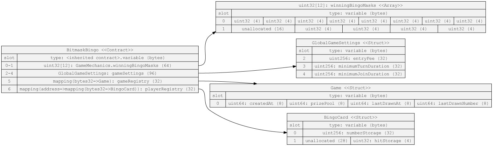

\# Bitmask Bingo

## Installation

`forge install`

## Testing

Foundry will print out logs (emitted events) from the tests and present a gas report.

`forge test -vv --gas-report`

Game simulations are tested in `./test/BitmaskBingo.t.sol`, whereas pure game logic is tested in `./test/GameLogic.t.sol`.

## Requirements

-   [x] Support multiple players in a game
-   [x] Support multiple concurrent games
-   [x] Each player pays an ERC20 entry fee, transferred on join
-   [x] Winner wins the pot of entry fees, transferred on win
-   [x] Games have a minimum join duration before start
-   [x] Games have a minimum turn duration between draws
-   [x] Admin can update the entry fee, join duration, and turn duration
-   [x] Interface exposing a public API (including getters and events) for a dApp to render current **and** historial game state
-   [x] summary of worst-case gas costs

## Design

### Optimizing storage using bitwise operations

To optimize for gas usage, we want to limit the number of `SLOAD` and `SSTORE` operations. To achieve this, we'll be storing the player's card ( a 5x5 grid of tiles, with each tile holding a uint8 in the range 0-255 ). We'll also store separately the "state" of each tile in the grid, ie. whether or not it's been hit ( `0` for open and `1` for hit ) as single bits. We'll make use of bitwise operations to read and write the values in each tile.

Because bits are read right to left, we'll use the bottom-right tile as the `0` index. The Tile indices look as follows:

```
Tile Indices:

24 23 22 21 20
19 18 17 16 15
14 13 12 11 10
9  8  7  6  5
4  3  2  1  0

```

This means we can store all 25 of the `uint8` tile values in a single `uint256`. This new `storageContainer` has a total of 32 `buckets`, where each bucket is `8` bits in size ( `32 * 8 = 256` ). Because we only require 25 buckets to store our game board, we'll simply ignore the left-most 7 buckets. The layout in binary representation would look something like:

```
0000000011111111...00000000
|__31__||__30__|   |___0__|
```

We can take the same approach to storing the hits/misses of the game board, represented as `0`s and `1`s, corresponding to the same bit indices ( read right-to-left ) as the bingo numbers. Because we require only 25 bits for this, we can store the hits in a `uint32`.

```
Eg.

grid:
0  0  0  0  1
0  0  0  0  1
0  0  0  0  1
0  0  0  0  1
0  0  0  0  1

take the right-most 25 bits:
0000000 | 00001 00001 00001 00001 00001
|_ 7 _|   |____________ 25 ___________|

represented in binary as:
00000000000100001000010000100001

which gives a decimal value of:
uint32 column = 1082401;

```

## Storage Layout

Install `sol2uml`:

```
npm install -g sol2uml
```

Then run:

```
sol2uml storage ./src -c BitmaskBingo -o ./images/gasStorage.svg
```

Result:



## Gas Report

As is evident from the gas report below (run the `forge test` CLI command with the `--gas-report` flag to get an up-to-date version ), the heaviest gas usage comes from `createGame`, `joinGame` and `claimPrize`. A non-trivial portion of the gas usage comes from the approval and transfer of the `ERC20` token and cannot be avoided, unless done outside of the and some sort of proof + balance check is implemented, but that's beyond the scope of this exercise. The heavy gas usage in `createGame` comes from the creation of the `Game` object, though some optimization has been achieved by utilizing struct packing to reduce the number of slots.

In the design of this system, the burden of heavier gas usage is on the creator of a game instance. Worst case scenario occurs when the creator of the game is also the player to draw a card for most (or every round) in order to keep the game progressing. The next iteration of the contract should take this into consideration, and perhaps have each joining player alternate the responsibility of drawing cards for each round.

By utilizing bitmaps and bitwise operations to handle storage of data, we've minimized what might've been a heavy cost of looping throw storage arrays and storing multiple separate values.

```
╭────────────────────────────────────────┬─────────────────┬───────┬────────┬───────┬─────────╮
│ src/BingoToken.sol:BingoToken contract ┆                 ┆       ┆        ┆       ┆         │
╞════════════════════════════════════════╪═════════════════╪═══════╪════════╪═══════╪═════════╡
│ Deployment Cost                        ┆ Deployment Size ┆       ┆        ┆       ┆         │
├╌╌╌╌╌╌╌╌╌╌╌╌╌╌╌╌╌╌╌╌╌╌╌╌╌╌╌╌╌╌╌╌╌╌╌╌╌╌╌╌┼╌╌╌╌╌╌╌╌╌╌╌╌╌╌╌╌╌┼╌╌╌╌╌╌╌┼╌╌╌╌╌╌╌╌┼╌╌╌╌╌╌╌┼╌╌╌╌╌╌╌╌╌┤
│ 659139                                 ┆ 3567            ┆       ┆        ┆       ┆         │
├╌╌╌╌╌╌╌╌╌╌╌╌╌╌╌╌╌╌╌╌╌╌╌╌╌╌╌╌╌╌╌╌╌╌╌╌╌╌╌╌┼╌╌╌╌╌╌╌╌╌╌╌╌╌╌╌╌╌┼╌╌╌╌╌╌╌┼╌╌╌╌╌╌╌╌┼╌╌╌╌╌╌╌┼╌╌╌╌╌╌╌╌╌┤
│ Function Name                          ┆ min             ┆ avg   ┆ median ┆ max   ┆ # calls │
├╌╌╌╌╌╌╌╌╌╌╌╌╌╌╌╌╌╌╌╌╌╌╌╌╌╌╌╌╌╌╌╌╌╌╌╌╌╌╌╌┼╌╌╌╌╌╌╌╌╌╌╌╌╌╌╌╌╌┼╌╌╌╌╌╌╌┼╌╌╌╌╌╌╌╌┼╌╌╌╌╌╌╌┼╌╌╌╌╌╌╌╌╌┤
│ approve                                ┆ 24669           ┆ 24669 ┆ 24669  ┆ 24669 ┆ 6       │
├╌╌╌╌╌╌╌╌╌╌╌╌╌╌╌╌╌╌╌╌╌╌╌╌╌╌╌╌╌╌╌╌╌╌╌╌╌╌╌╌┼╌╌╌╌╌╌╌╌╌╌╌╌╌╌╌╌╌┼╌╌╌╌╌╌╌┼╌╌╌╌╌╌╌╌┼╌╌╌╌╌╌╌┼╌╌╌╌╌╌╌╌╌┤
│ balanceOf                              ┆ 2552            ┆ 2552  ┆ 2552   ┆ 2552  ┆ 2       │
├╌╌╌╌╌╌╌╌╌╌╌╌╌╌╌╌╌╌╌╌╌╌╌╌╌╌╌╌╌╌╌╌╌╌╌╌╌╌╌╌┼╌╌╌╌╌╌╌╌╌╌╌╌╌╌╌╌╌┼╌╌╌╌╌╌╌┼╌╌╌╌╌╌╌╌┼╌╌╌╌╌╌╌┼╌╌╌╌╌╌╌╌╌┤
│ mint                                   ┆ 25453           ┆ 47353 ┆ 47353  ┆ 69253 ┆ 18      │
├╌╌╌╌╌╌╌╌╌╌╌╌╌╌╌╌╌╌╌╌╌╌╌╌╌╌╌╌╌╌╌╌╌╌╌╌╌╌╌╌┼╌╌╌╌╌╌╌╌╌╌╌╌╌╌╌╌╌┼╌╌╌╌╌╌╌┼╌╌╌╌╌╌╌╌┼╌╌╌╌╌╌╌┼╌╌╌╌╌╌╌╌╌┤
│ transferFrom                           ┆ 4402            ┆ 19871 ┆ 25983  ┆ 32478 ┆ 6       │
╰────────────────────────────────────────┴─────────────────┴───────┴────────┴───────┴─────────╯
╭────────────────────────────────────────────┬─────────────────┬───────┬────────┬───────┬─────────╮
│ src/BitmaskBingo.sol:BitmaskBingo contract ┆                 ┆       ┆        ┆       ┆         │
╞════════════════════════════════════════════╪═════════════════╪═══════╪════════╪═══════╪═════════╡
│ Deployment Cost                            ┆ Deployment Size ┆       ┆        ┆       ┆         │
├╌╌╌╌╌╌╌╌╌╌╌╌╌╌╌╌╌╌╌╌╌╌╌╌╌╌╌╌╌╌╌╌╌╌╌╌╌╌╌╌╌╌╌╌┼╌╌╌╌╌╌╌╌╌╌╌╌╌╌╌╌╌┼╌╌╌╌╌╌╌┼╌╌╌╌╌╌╌╌┼╌╌╌╌╌╌╌┼╌╌╌╌╌╌╌╌╌┤
│ 1428771                                    ┆ 7127            ┆       ┆        ┆       ┆         │
├╌╌╌╌╌╌╌╌╌╌╌╌╌╌╌╌╌╌╌╌╌╌╌╌╌╌╌╌╌╌╌╌╌╌╌╌╌╌╌╌╌╌╌╌┼╌╌╌╌╌╌╌╌╌╌╌╌╌╌╌╌╌┼╌╌╌╌╌╌╌┼╌╌╌╌╌╌╌╌┼╌╌╌╌╌╌╌┼╌╌╌╌╌╌╌╌╌┤
│ Function Name                              ┆ min             ┆ avg   ┆ median ┆ max   ┆ # calls │
├╌╌╌╌╌╌╌╌╌╌╌╌╌╌╌╌╌╌╌╌╌╌╌╌╌╌╌╌╌╌╌╌╌╌╌╌╌╌╌╌╌╌╌╌┼╌╌╌╌╌╌╌╌╌╌╌╌╌╌╌╌╌┼╌╌╌╌╌╌╌┼╌╌╌╌╌╌╌╌┼╌╌╌╌╌╌╌┼╌╌╌╌╌╌╌╌╌┤
│ createGame                                 ┆ 12397           ┆ 31060 ┆ 33625  ┆ 42031 ┆ 5       │
├╌╌╌╌╌╌╌╌╌╌╌╌╌╌╌╌╌╌╌╌╌╌╌╌╌╌╌╌╌╌╌╌╌╌╌╌╌╌╌╌╌╌╌╌┼╌╌╌╌╌╌╌╌╌╌╌╌╌╌╌╌╌┼╌╌╌╌╌╌╌┼╌╌╌╌╌╌╌╌┼╌╌╌╌╌╌╌┼╌╌╌╌╌╌╌╌╌┤
│ getGameSettings                            ┆ 573             ┆ 573   ┆ 573    ┆ 573   ┆ 1       │
├╌╌╌╌╌╌╌╌╌╌╌╌╌╌╌╌╌╌╌╌╌╌╌╌╌╌╌╌╌╌╌╌╌╌╌╌╌╌╌╌╌╌╌╌┼╌╌╌╌╌╌╌╌╌╌╌╌╌╌╌╌╌┼╌╌╌╌╌╌╌┼╌╌╌╌╌╌╌╌┼╌╌╌╌╌╌╌┼╌╌╌╌╌╌╌╌╌┤
│ joinGame                                   ┆ 9180            ┆ 12107 ┆ 12107  ┆ 15035 ┆ 2       │
├╌╌╌╌╌╌╌╌╌╌╌╌╌╌╌╌╌╌╌╌╌╌╌╌╌╌╌╌╌╌╌╌╌╌╌╌╌╌╌╌╌╌╌╌┼╌╌╌╌╌╌╌╌╌╌╌╌╌╌╌╌╌┼╌╌╌╌╌╌╌┼╌╌╌╌╌╌╌╌┼╌╌╌╌╌╌╌┼╌╌╌╌╌╌╌╌╌┤
│ updateEntryFee                             ┆ 5309            ┆ 5309  ┆ 5309   ┆ 5309  ┆ 1       │
├╌╌╌╌╌╌╌╌╌╌╌╌╌╌╌╌╌╌╌╌╌╌╌╌╌╌╌╌╌╌╌╌╌╌╌╌╌╌╌╌╌╌╌╌┼╌╌╌╌╌╌╌╌╌╌╌╌╌╌╌╌╌┼╌╌╌╌╌╌╌┼╌╌╌╌╌╌╌╌┼╌╌╌╌╌╌╌┼╌╌╌╌╌╌╌╌╌┤
│ updateJoinDuration                         ┆ 5353            ┆ 5353  ┆ 5353   ┆ 5353  ┆ 1       │
├╌╌╌╌╌╌╌╌╌╌╌╌╌╌╌╌╌╌╌╌╌╌╌╌╌╌╌╌╌╌╌╌╌╌╌╌╌╌╌╌╌╌╌╌┼╌╌╌╌╌╌╌╌╌╌╌╌╌╌╌╌╌┼╌╌╌╌╌╌╌┼╌╌╌╌╌╌╌╌┼╌╌╌╌╌╌╌┼╌╌╌╌╌╌╌╌╌┤
│ updateUpdateTurnDuration                   ┆ 5288            ┆ 5288  ┆ 5288   ┆ 5288  ┆ 1       │
╰────────────────────────────────────────────┴─────────────────┴───────┴────────┴───────┴─────────╯
```